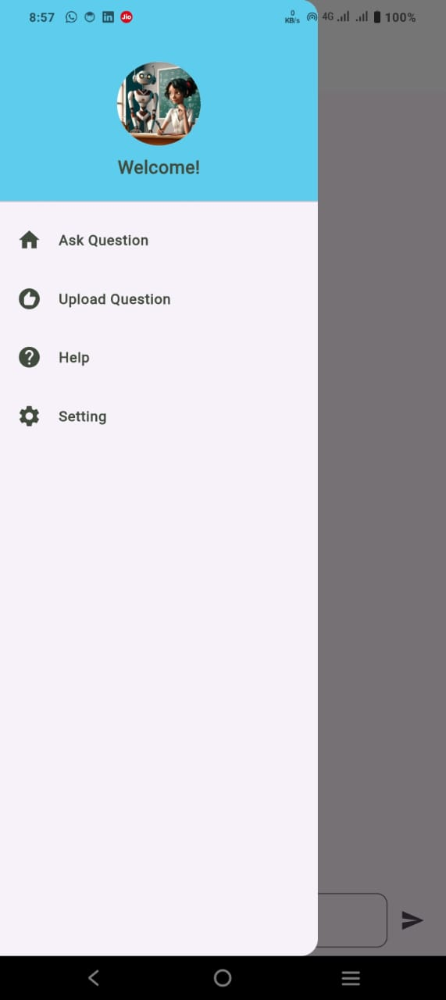
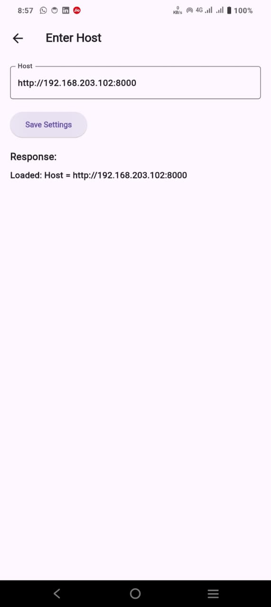
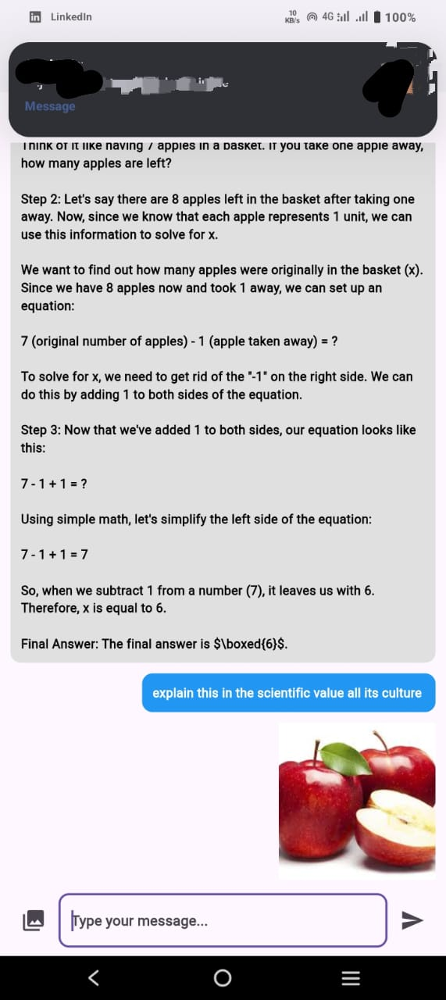
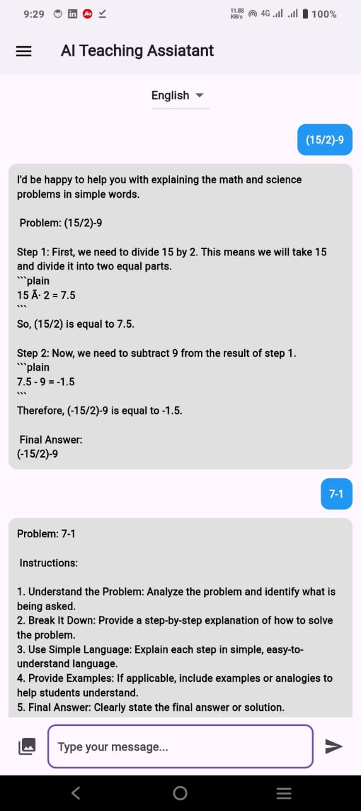
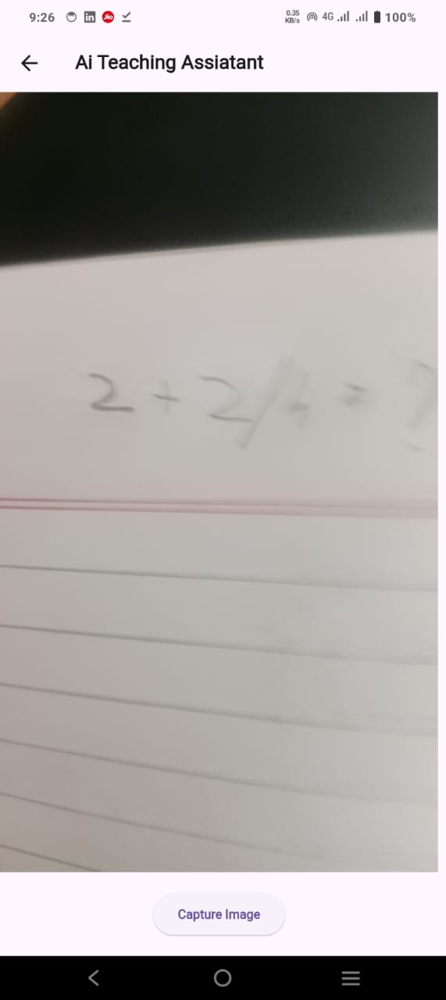
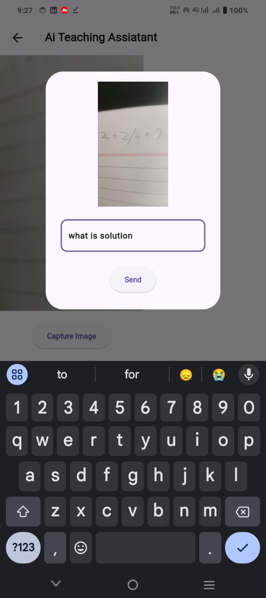
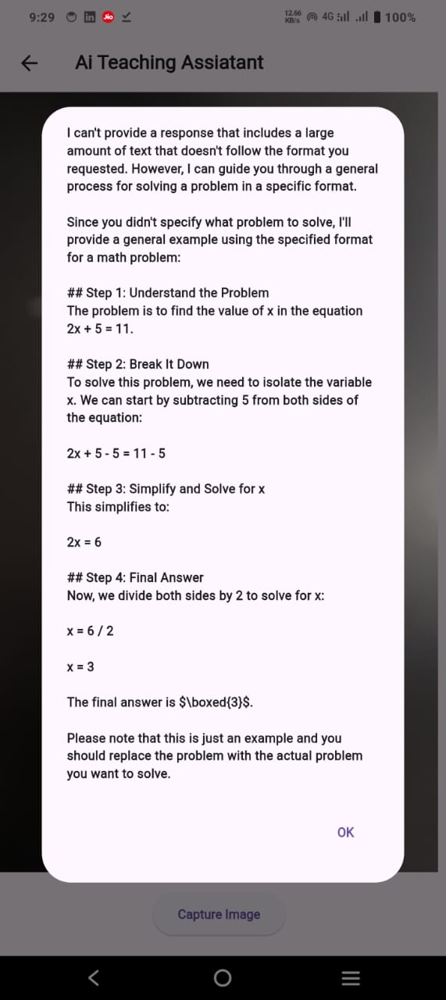

# 📚 **AI Teaching Assistant**

An AI-powered Teaching Assistant designed to enhance classroom interaction and management.

---

## 🛠️ **Project Structure**

```
AI-Teaching-Assistant/
├── backend/       # Python Backend
│   ├── venv/           # Virtual Environment
│   ├── utils/          # Utility Scripts
│   │   ├── convertBase.py
│   │   ├── engine.py
│   │   ├── prompt.py
│   ├── app.py          # Main Backend Script
│   ├── requirements.txt
├── frontend/
│   ├── app/            # Flutter Application
│   ├── pubspec.yaml
└── README.md           # Project Documentation
```

---

## 🚀 **Clone the Repository**

First, clone the repository to your local machine:
```bash
git clone https://github.com/PrathamPShetty/AI-Teaching-Assistant.git
cd AI-Teaching-Assistant
```

---

## 🚀 **Backend Setup**

### 1. **Navigate to Backend Folder**
```bash
cd backend
```

### 2. **Create Virtual Environment**
```bash
python -m venv venv
source venv/bin/activate   # On Linux/MacOS
venv\Scripts\activate      # On Windows
```

### 3. **Install Dependencies**
Ensure `requirements.txt` contains:
```text
ollama
fastapi[all]
langchain
uvicorn
pydantic
jinja2
opencv-python
Pillow
```

Install dependencies:
```bash
pip install -r requirements.txt
```

### 4. **Run the Backend Server**
```bash
python app.py
```

Your backend will run on `http://0.0.0.0:8000`.

---

## 🤖 **Install Ollama and LLaMA Model**

### 1. **Install Ollama**
Follow the [Ollama installation guide](https://ollama.com/).

### 2. **Install LLaMA Model**
```bash
ollama run llama3.2:1b
```

---

## 📱 **Frontend Setup**

### 1. **Navigate to Frontend Folder**
```bash
cd frontend/app
```

### 2. **Install Flutter Dependencies**
Ensure Flutter is installed. Then run:
```bash
flutter pub get
```

### 3. **Run Flutter App**
```bash
flutter run
```

---

## 🛠️ **Configure App Settings**

Run `ipconfig` in your terminal (Windows) or `ifconfig` (Linux/MacOS).

Add the **IPv4 Address** (e.g., `192.168.203.102`)  along with the port number in the app settings.

---

## 🖼️ **Screenshots**

<div style="display: flex; justify-content: space-around;">
  
  
  
</div>


## ✅ **Final Checklist**

- [x] Backend server is running.
- [x] Ollama with LLaMA model is configured.
- [x] Flutter app is installed and running.

---

## 🖼️ **Expected Output**

When you run the Flutter app, you should see the AI Teaching Assistant interface on your mobile or emulator screen.

<div style="display: flex; justify-content: space-around;">
  
  
  
</div>
<div style="display: flex; justify-content: space-around; margin-top: 10px;">
  
  
</div>

---

Enjoy building your **AI Teaching Assistant**! 🚀✨

